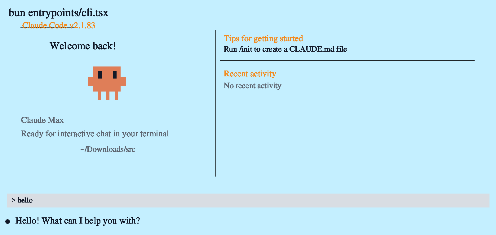

# Claude Code

 [![npm]](https://www.npmjs.com/package/@anthropic-ai/claude-code)

[npm]: https://img.shields.io/npm/v/@anthropic-ai/claude-code.svg?style=flat-square

Claude Code is an agentic coding tool that lives in your terminal, understands your codebase, and helps you code faster by executing routine tasks, explaining complex code, and handling git workflows -- all through natural language commands. Use it in your terminal, IDE, or tag @claude on Github.

**Learn more at [Claude Code Homepage](https://claude.com/product/claude-code)** | [Documentation](https://code.claude.com/docs/en/overview)


## Get started

### Install Claude Code from npm

```sh
npm install -g @anthropic-ai/claude-code
```

Then navigate to your project directory and run `claude`.

### Run this repository from source

If you want to run this source snapshot directly, use Bun:

```sh
bun install
bun entrypoints/cli.tsx
```

Helpful checks:

```sh
bun entrypoints/cli.tsx --help
bun entrypoints/cli.tsx --version
```

### Local run preview



## Reporting Bugs

We welcome your feedback. Use the `/bug` command to report issues directly within Claude Code, or file a [GitHub issue](https://github.com/anthropics/claude-code/issues).

## Connect on Discord

Join the [Claude Developers Discord](https://anthropic.com/discord) to connect with other developers using Claude Code. Get help, share feedback, and discuss your projects with the community.

## Data collection, usage, and retention

When you use Claude Code, we collect feedback, which includes usage data (such as code acceptance or rejections), associated conversation data, and user feedback submitted via the `/bug` command.

### How we use your data

See our [data usage policies](https://code.claude.com/docs/en/data-usage).

### Privacy safeguards

We have implemented several safeguards to protect your data, including limited retention periods for sensitive information and restricted access to user session data.

For full details, please review our [Commercial Terms of Service](https://www.anthropic.com/legal/commercial-terms) and [Privacy Policy](https://www.anthropic.com/legal/privacy).
